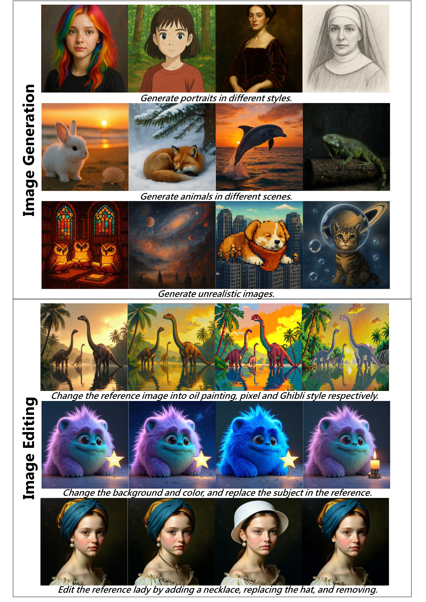
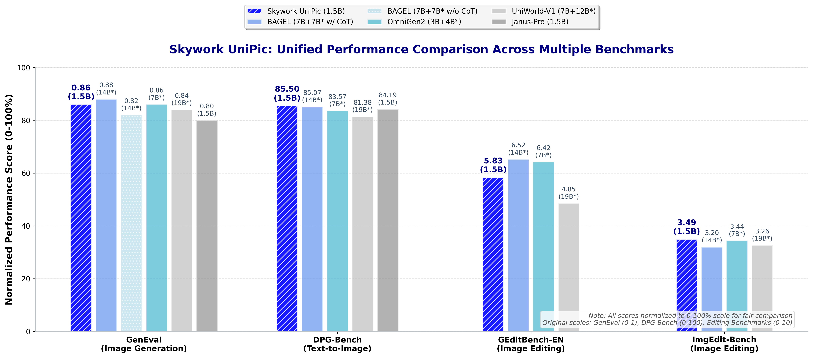

<!-- markdownlint-disable first-line-h1 -->
<!-- markdownlint-disable html -->
<!-- markdownlint-disable no-duplicate-header -->

<div align="center">
  <h1><strong>SkyworkUniPic</strong></h1>
</div>

<font size=7><div align='center' >  [[🤗 UniPic checkpoint](https://huggingface.co/Skywork/Skywork-UniPic-1.5B)] [[📖 Tech Report](https://github.com/SkyworkAI/UniPic/blob/main/UNIPIC.pdf)] [[🏄 Web Demo](https://huggingface.co/spaces/Skywork/UniPic)]</div></font> 

Welcome to the Skywork-UniPic repository! This repository contains the model weights and implementation of our unified 1.5B-parameter autoregressive model that natively integrates image understanding, text-to-image generation, and image editing capabilities within a single architecture.


<div align="center">
  
</div>

## Evaluation

<p align="center"><strong>Performance Overview</strong></p>

<div align="center">
  
</div>

<p align="center"><strong>GenEval</strong></p>
<div align="center">


| Model | Single | Two | Count | Color | Position | Attr | **Overall** |
|:------|:------:|:---:|:-----:|:-----:|:--------:|:----:|:-----------:|
| **Diffusion Models** |||||||||
| SDv2.1          | 0.98 | 0.51 | 0.44 | 0.85 | 0.07 | 0.17 | 0.50 |
| SDXL            | 0.98 | 0.74 | 0.39 | 0.85 | 0.15 | 0.23 | 0.55 |
| IF‑XL           | 0.97 | 0.74 | 0.66 | 0.81 | 0.13 | 0.35 | 0.61 |
| LUMINA‑Next     | 0.92 | 0.46 | 0.48 | 0.70 | 0.09 | 0.13 | 0.46 |
| SD3‑medium      | 0.99 | 0.94 | 0.72 | 0.89 | 0.33 | 0.60 | 0.74 |
| FLUX.1‑dev      | 0.99 | 0.81 | 0.79 | 0.74 | 0.20 | 0.47 | 0.67 |
| NOVA            | 0.99 | 0.91 | 0.62 | 0.85 | 0.33 | 0.56 | 0.71 |
| **Autoregressive Models** |||||||||
| TokenFlow‑XL    | 0.95 | 0.60 | 0.41 | 0.81 | 0.16 | 0.24 | 0.55 |
| Janus           | 0.97 | 0.68 | 0.30 | 0.84 | 0.46 | 0.42 | 0.61 |
| Janus Pro       | 0.99 | 0.89 | 0.59 | 0.90 | 0.79 | 0.66 | 0.80 |
| Emu3‑Gen        | 0.99 | 0.81 | 0.42 | 0.80 | 0.49 | 0.45 | 0.66 |
| Show‑o          | 0.98 | 0.80 | 0.66 | 0.84 | 0.31 | 0.50 | 0.68 |
| **Unified Models** |||||||||
| OmniGen         | 0.98 | 0.84 | 0.66 | 0.74 | 0.40 | 0.43 | 0.68 |
| OmniGen2        | 1.00 | 0.95 | 0.64 | 0.88 | 0.55 | 0.76 | 0.80 |
| OmniGen2†       | 0.99 | 0.96 | 0.74 | 0.98 | 0.71 | 0.75 | 0.86 |
| MetaQuery‑XL†   |   -  |   -  |   -  |   -  |   -  |   -  | 0.80 |
| BLIP3‑o† 4B     |   -  |   -  |   -  |   -  |   -  |   -  | 0.81 |
| BLIP3‑o† 8B     |   -  |   -  |   -  |   -  |   -  |   -  | 0.84 |
| BAGEL           | 0.99 | 0.94 | 0.81 | 0.88 | 0.64 | 0.63 | 0.82 |
| BAGEL†          | 0.98 | 0.95 | 0.84 | 0.95 | 0.78 | 0.77 | 0.88 |
| UniWorld‑V1     | 0.99 | 0.93 | 0.79 | 0.89 | 0.49 | 0.70 | 0.80 |
| UniWorld‑V1†    | 0.98 | 0.93 | 0.81 | 0.89 | 0.74 | 0.71 | 0.84 |
| Ovis‑U1         | 0.98 | 0.98 | 0.90 | 0.92 | 0.79 | 0.75 | 0.89 |
| **Proprietary Models** |||||||||
| GPT‑4o          | 0.99 | 0.92 | 0.85 | 0.92 | 0.75 | 0.61 | 0.84 |
| **Skywork UniPic** | **0.98** | **0.92** | **0.74** | **0.91** | **0.89** | **0.72** | **0.86** |

</div>


<p align="center"><strong>DPG‑Bench</strong></p>
<div align="center">

| Model | Global | Entity | Attribute | Relation | Other | **Overall** |
|:------|:------:|:------:|:---------:|:--------:|:-----:|:-----------:|
| **Diffusion Models** |||||||
| LUMINA‑Next      | 82.82 | 88.65 | 86.44 | 80.53 | 81.82 | 74.63 |
| SDXL             | 83.27 | 82.43 | 80.91 | 86.76 | 80.41 | 74.65 |
| PlayGroundv2.5   | 83.06 | 82.59 | 81.20 | 84.08 | 83.50 | 75.47 |
| Hunyuan‑DiT      | 84.59 | 80.59 | 88.01 | 74.36 | 86.41 | 78.87 |
| PixArt‑Σ         | 86.89 | 82.89 | 88.94 | 86.59 | 87.68 | 80.54 |
| DALLE3           | 90.97 | 89.61 | 88.39 | 90.58 | 89.83 | 83.50 |
| SD3‑medium       | 87.90 | 91.01 | 88.83 | 80.70 | 88.68 | 84.08 |
| FLUX.1‑dev       | 82.10 | 89.50 | 88.70 | 91.10 | 89.40 | 84.00 |
| **Autoregressive Models** |||||||
| Show‑o           | 79.33 | 75.44 | 78.02 | 84.45 | 60.80 | 67.27 |
| EMU3             | 85.21 | 86.68 | 86.84 | 90.22 | 83.15 | 80.60 |
| TokenFlow‑XL     | 78.72 | 79.22 | 81.29 | 85.22 | 71.20 | 73.38 |
| Janus            | 82.33 | 87.38 | 87.70 | 85.46 | 86.41 | 79.68 |
| Janus Pro        | 86.90 | 88.90 | 89.40 | 89.32 | 89.48 | 84.19 |
| BLIP3‑o 4B       |   -   |   -   |   -   |   -   |   -   | 79.36 |
| BLIP3‑o 8B       |   -   |   -   |   -   |   -   |   -   | 81.60 |
| **Unified Models** |||||||
| OmniGen          | 87.90 | 88.97 | 88.47 | 87.95 | 83.56 | 81.16 |
| OmniGen2         | 88.81 | 88.83 | 90.18 | 89.37 | 90.27 | 83.57 |
| BAGEL            | 88.94 | 90.37 | 91.29 | 90.82 | 88.67 | 85.07 |
| UniWorld‑V1      | 83.64 | 88.39 | 88.44 | 89.27 | 87.22 | 81.38 |
| Ovis‑U1          | 82.37 | 90.08 | 88.68 | 93.35 | 85.20 | 83.72 |
| **Skywork UniPic** | **89.65** | **87.78** | **90.84** | **91.89** | **91.95** | **85.50** |

</div>

<p align="center"><strong>GEdit‑Bench‑EN</strong></p>
<div align="center">

| Model | SC ↑ | PQ ↑ | **Overall ↑** |
|:------|:----:|:----:|:--------------:|
| **Proprietary Models** ||||
| Gemini‑2.0‑flash | 6.73 | 6.61 | 6.32 |
| GPT‑4o           | 7.85 | 7.62 | 7.53 |
| **Specialized Editing Models** ||||
| Instruct‑Pix2Pix | 3.58 | 5.49 | 3.68 |
| MagicBrush       | 4.68 | 5.66 | 4.52 |
| AnyEdit          | 3.18 | 5.82 | 3.21 |
| ICEdit           | 5.11 | 6.85 | 4.84 |
| Step1X‑Edit      | 7.09 | 6.76 | 6.70 |
| **Unified Models** ||||
| OmniGen          | 5.96 | 5.89 | 5.06 |
| OmniGen2         | 7.16 | 6.77 | 6.41 |
| BAGEL            | 7.36 | 6.83 | 6.52 |
| UniWorld‑V1      | 4.93 | 7.43 | 4.85 |
| Ovis‑U1          |   -  |   -  | 6.42 |
| **Skywork UniPic** | **6.72** | **6.18** | **5.83** |

</div>
</div>

## Usage

### 📦 Required Packages
Create virtual environment and install dependencies with pip:
```shell
conda create -n unipic python==3.10.14
conda activate unipic
pip install -r requirements.txt
```


### 📥 Checkpoints

Download the model checkpoints from [[🤗 SkyworkUniPic](https://huggingface.co/Skywork/Skywork-UniPic-1.5B)],
It is recommended to use the following command to download the checkpoints
```bash
# pip install -U "huggingface_hub[cli]"
huggingface-cli download Skywork/Skywork-UniPic-1.5B  --local-dir checkpoint --repo-type model
```
### ✏️ Image Editing
```shell
# only support 1024 image_size
export PYTHONPATH=./:$PYTHONPATH
python scripts/image_edit.py configs/models/qwen2_5_1_5b_kl16_mar_h.py \
         --checkpoint checkpoint/pytorch_model.bin  --image_size 1024 \
         --image data/sample.png --prompt "Replace the stars with the candle." \
         --output output.jpg 
```

### 🖼️ Text-to-image Generation

You can generate images from text prompts using the following command:

```shell
# only support 1024 image_size
export PYTHONPATH=./:$PYTHONPATH
python scripts/text2image.py configs/models/qwen2_5_1_5b_kl16_mar_h.py \
         --checkpoint checkpoint/pytorch_model.bin  --image_size 1024 \
         --prompt 'A glossy-coated golden retriever stands on the park lawn beside a life-sized penguin statue.'  --output output.jpg
```

To generate a list of images based on prompts in a json file.
```shell
export PYTHONPATH=./:$PYTHONPATH
accelerate launch scripts/batch_text2image.py configs/models/qwen2_5_1_5b_kl16_mar_h.py \
       --checkpoint checkpoint/pytorch_model.bin  --image_size 1024 \
       --data data/batch_t2i.json --output output --batch_size 2 --grid_size 2
```
The json file should look like:

```json
[
  {
   "prompt": "A glossy-coated golden retriever stands on the park lawn beside a life-sized penguin statue."
  },
  {
   "prompt": "Digital portrait of a girl with rainbow hair."
  }
]
```

### 📖 Image-to-text Generation

```shell
export PYTHONPATH=./:$PYTHONPATH
python scripts/image2text.py configs/models/qwen2_5_1_5b_kl16_mar_h.py \
         --checkpoint checkpoint/pytorch_model.bin  --image_size 1024 \
         --image data/sample.png --prompt "Describe the image in detail."
```


## 📜 License
This project is licensed under [MIT License](LICENSE).
