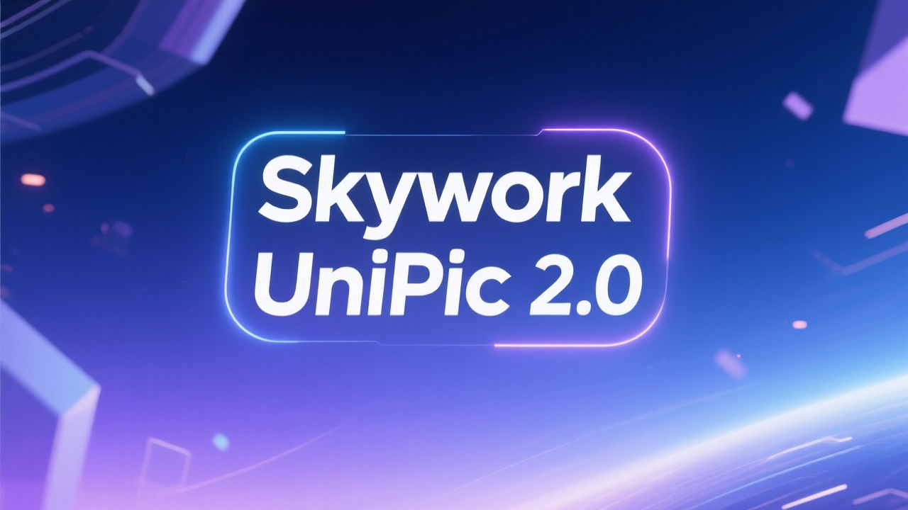
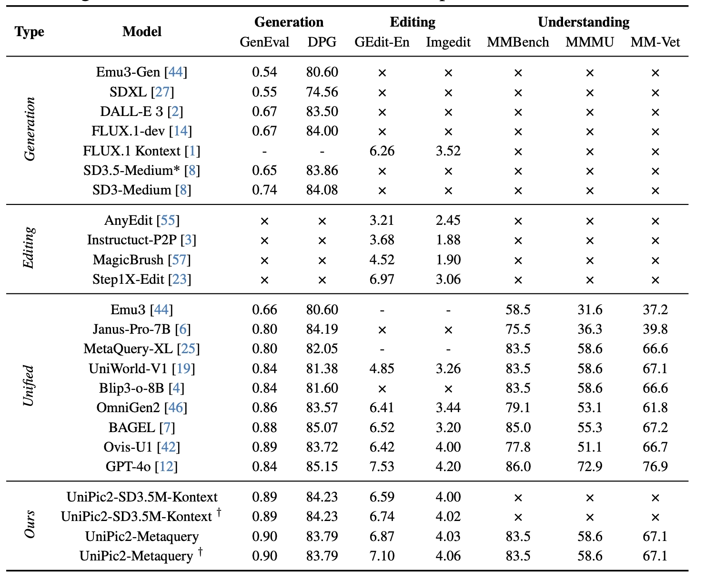

<div align="center">
  <h1><strong>Skywork-UniPic2</strong></h1>
</div>

<font size=7><div align='center' >  [[🤗 UniPic2 checkpoint](https://huggingface.co/collections/Skywork/skywork-unipic2-6899b9e1b038b24674d996fd)] [[📖 Tech Report](assets/pdf/UNIPIC2.pdf)] </font> </div>

<div align="center">
  
</div>

Welcome to the Skywork-UniPic2.0 repository! This repository features the model weights and implementation of our advanced unified multimodal model, UniPic2-SD3.5M-Kontext and UniPic2-MetaQuery, which deliver state-of-the-art performance in text-to-image generation, image editing, and multimodal understanding through efficient architecture design and progressive training strategies.

<div align="center">
  
</div>

## What's New in UniPic2

- **Enhanced Architecture**: Improved model architecture based on Stable Diffusion 3.5 and Flux
- **Better Image Quality**: Advanced preprocessing and generation techniques
- **Unified Framework**: Seamless integration of text-to-image and image editing tasks
- **Optimized Inference**: More efficient inference pipeline with better memory management
- **Advanced Parameters**: Fine-grained control over generation quality and style

## Evaluation

<div align="center">
  
</div>

## Usage

### 📦 Required Packages
Create virtual environment and install dependencies with pip:
```shell
conda create -n unipic_v2 python==3.10
conda activate unipic_v2
pip install -r requirements.txt
```

### 📥 Checkpoints

Download the model checkpoints from [🤗 Skywork UniPic2](https://huggingface.co/collections/Skywork/skywork-unipic2-6899b9e1b038b24674d996fd).

### 🚀 Quick Start with Scripts

We provide four standalone scripts for different inference modes:

#### Method 1: SD3.5M Kontext

**Text-to-Image Generation:**
```bash
python scripts/unipic2_sd35m_kontext_t2i.py \
    --checkpoint_path /path/to/unipic2_sd35m_kontext \
    --prompt "a pig with wings and a top hat flying over a happy futuristic scifi city" \
    --output text2image.png \
    --height 512 --width 384 \
    --num_inference_steps 50 \
    --guidance_scale 3.5 \
    --seed 42
```

**Image Editing:**
```bash
python scripts/unipic2_sd35m_kontext_editing.py \
    --checkpoint_path /path/to/unipic2_sd35m_kontext \
    --input_image text2image.png \
    --prompt "remove the pig's hat" \
    --output image_editing.png \
    --image_size 512 \
    --num_inference_steps 50 \
    --guidance_scale 3.5 \
    --seed 42
```

#### Method 2: Qwen2.5-VL + SD3.5M Kontext

**Text-to-Image Generation:**
```bash
python scripts/unipic2_mq_t2i.py \
    --checkpoint_path /path/to/unipic2_mq \
    --prompt "a pig with wings and a top hat flying over a happy futuristic scifi city" \
    --output qwen_text2image.png \
    --height 512 --width 384 \
    --num_inference_steps 50 \
    --guidance_scale 3.5 \
    --seed 42
```

**Image Editing with Vision Input:**
```bash
python scripts/unipic2_mq_editing.py \
    --checkpoint_path /path/to/unipic2_mq \
    --input_image input_image.png \
    --prompt "remove the pig's hat" \
    --output qwen_image_editing.png \
    --image_size 512 \
    --num_inference_steps 50 \
    --guidance_scale 3.5 \
    --seed 42
```

### 5. Run Gradio on Windows for SD3.5M Kontext

To use the Gradio interface on Windows with all dependencies installed:
```bash
git clone https://github.com/SkyworkAI/UniPic.git
cd UniPic/UniPic-2
```

Use Anaconda:
```bash
conda create -n unipic python=3.10
conda activate unipic
```

Install CUDA 12.8:
```bash
conda install -c nvidia/label/cuda-12.8.0 cuda -y
```

Install uv and the main dependencies:
```bash
pip install uv
uv pip install -r requirements_win.txt
```

Install PyTorch compatible with CUDA:
```bash
uv pip install torch torchvision torchaudio --extra-index-url https://download.pytorch.org/whl/cu128 --force-reinstall
```

Download the models:
```bash
python download.py
```

Launch the Gradio interface:
```bash
python run_gradio.py
```
